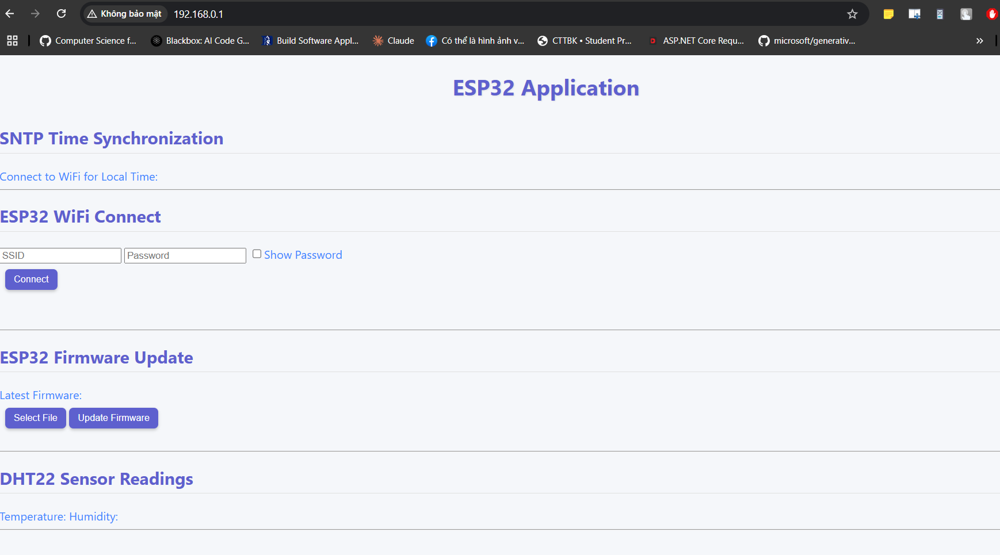

| Supported Targets | ESP32 | ESP32-C2 | ESP32-C3 | ESP32-C5 | ESP32-C6 | ESP32-C61 | ESP32-H2 | ESP32-P4 | ESP32-S2 | ESP32-S3 | Linux |
| ----------------- | ----- | -------- | -------- | -------- | -------- | --------- | -------- | -------- | -------- | -------- | ----- |

# ESP32_IoT_SERIES

The project gathers commonly used ESP32 functions and modules for IoT development. It is my learning process conducted in the lab, with references from sources such as the ESP-IDF website and some Udemy courses.

## Hardware Requirements

- ESP32 Development Kit  
- UART to USB cable  
- DHT22 Sensor  

## Software Requirements
- ESP-IDF on VS Code  
- An AWS IoT account (for the MQTT feature)

## How to Use the Project

1. Set up DHT22 pins and connections.  
2. Build, flash project and monitor device (ESP32).  
3. Connect a device (laptop or smartphone) to the "ESP32_AP" Wi-Fi network.  
4. Access the given IP address on the monitor.  
5. After accessing the ESP server's website by your device, the expected result should be as follows:  

Feel free to try out some features, such as: Wi-Fi Connection, OTA updates, and checking temperature and humidity.  

## Note

Some features are still in development and may not work smoothly. 
